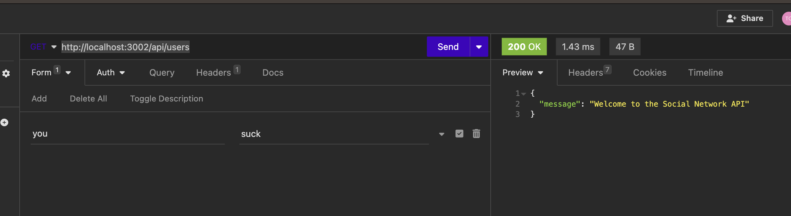

# Social Network API

## My Project

The project is to build an API for a social network web application where users can share their thoughts, react to friends’ thoughts, and create a friend list. I will use Express.js for routing, a MongoDB database, and the Mongoose ODM. In addition to using the [Express.js](https://www.npmjs.com/package/express) and [Mongoose](https://www.npmjs.com/package/mongoose) packages, I may also optionally use a JavaScript date library of my choice or the native JavaScript `Date` object to format timestamps.

I will create my own data using Insomnia after I have created my API.

## User Story

```md
AS A social media startup
I WANT an API for my social network that uses a NoSQL database
SO THAT my website can handle large amounts of unstructured data
```

## Acceptance Criteria

```md
GIVEN a social network API
WHEN I enter the command to invoke the application
THEN my server is started and the Mongoose models are synced to the MongoDB database
WHEN I open API GET routes in Insomnia for users and thoughts
THEN the data for each of these routes is displayed in a formatted JSON
WHEN I test API POST, PUT, and DELETE routes in Insomnia
THEN I am able to successfully create, update, and delete users and thoughts in my database
WHEN I test API POST and DELETE routes in Insomnia
THEN I am able to successfully create and delete reactions to thoughts and add and remove friends to a user’s friend list
```

## Mock Up

The following animations show examples of the application's API routes being tested in Insomnia. This is what it should function like when finished.

The following animation shows GET routes to return all users and all thoughts being tested in Insomnia:


The following animation shows GET routes to return a single user and a single thought being tested in Insomnia:


The following animation shows the POST, PUT, and DELETE routes for users being tested in Insomnia:


The following animation shows the POST and DELETE routes for a user’s friend list being tested in Insomnia:


This is the goal! 

## Notes

April 25, 2024: Revisiting this project to finish it and fix all of the issues associated with it.  

May 6: Finished code but still get arrors. Not sure why. Will keep testing. 

## Usage

The following images show the CURRENT web application's appearance and functionality. Keep in mind this is a work in progress, it is NOT complete yet (see Notes above).

 

## Installations

To install this application you need to clone the code, open the code in your IDE. To run this application, enter the following in the terminal: ```npm install``` & ```npm start```.

## Links

[Repository](https://github.com/Gera1313/social-network)

[Walkthrough video Link](https://youtu.be/easco5NMiAQ)

[MongoDB installation guide on The Full-Stack Blog](https://coding-boot-camp.github.io/full-stack/mongodb/how-to-install-mongodb)

## Licenses

## [](https://opensource.org/licenses/MIT)  